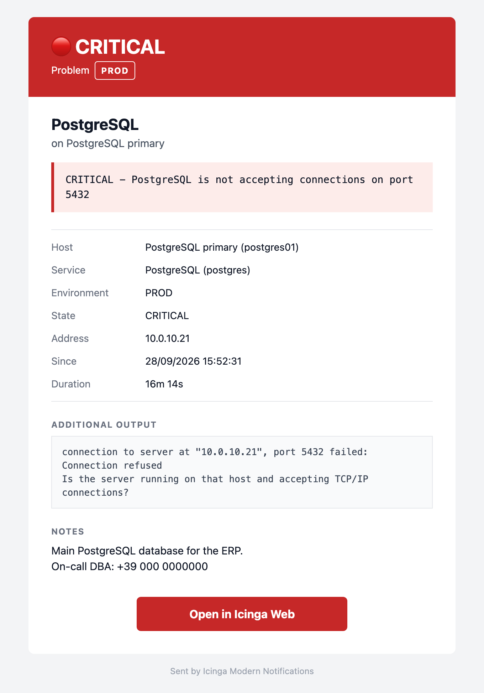
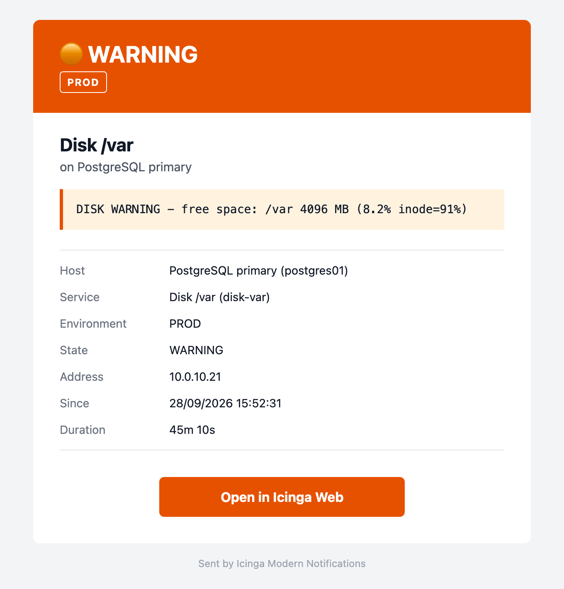
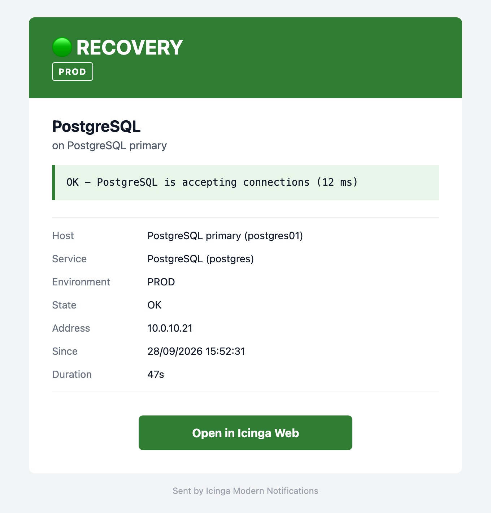
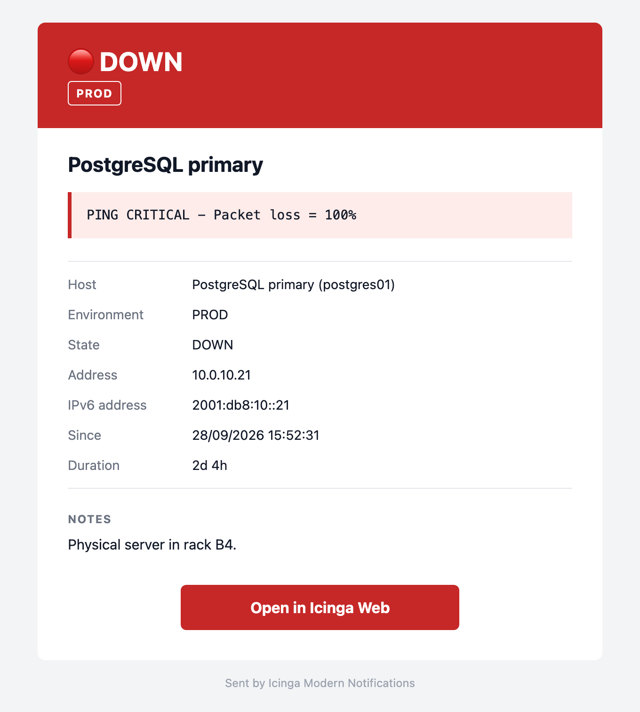
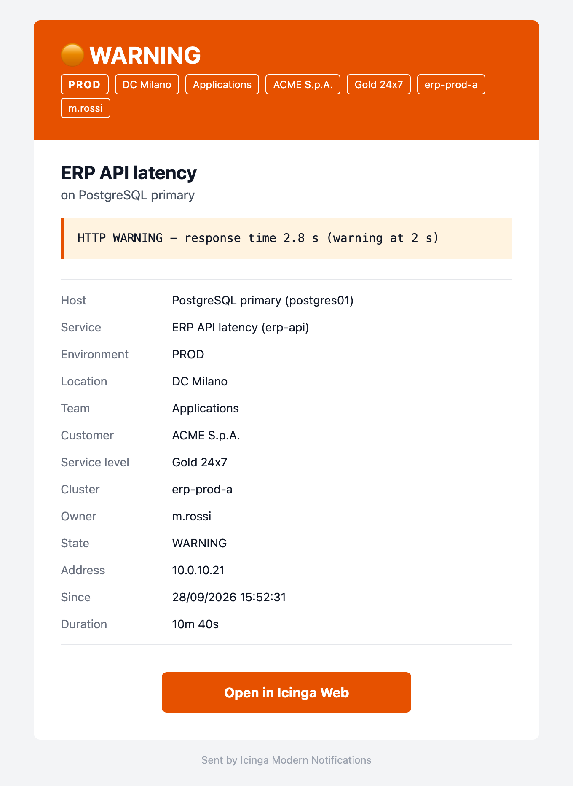
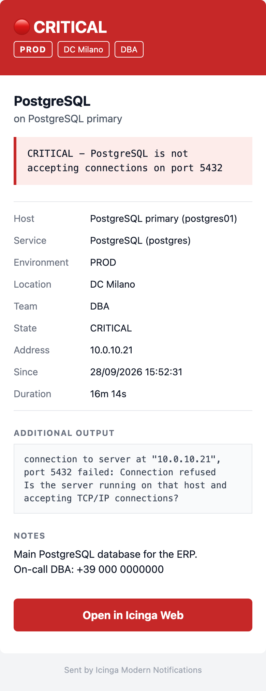

# Icinga Modern Notifications

Modern, extensible and responsive notifications for Icinga 2.

Icinga Modern Notifications receives notification data from Icinga 2 through a
stable command-line interface, normalises it into a channel-independent
notification model and delivers a clean, readable message:

- responsive HTML email that works on desktop and mobile clients, with a
  complete plain-text alternative;
- the state is recognisable at a glance through text, colour and emoji
  (🔴 CRITICAL/DOWN, 🟠 WARNING, 🟣 UNKNOWN, 🟢 RECOVERY);
- optional information (environment, addresses, notes, comments, Icinga Web
  link, ...) is omitted completely when it is not available;
- custom tags (location, team, customer, ...) chosen in the Icinga
  configuration are shown next to the environment;
- presentation lives in Jinja2 templates that can be customised without
  touching Python code.

> **Note:** the project is designed to support multiple notification channels
> over time. **Currently only email is supported.**

## Screenshots

| Service CRITICAL | Service WARNING | Service RECOVERY |
| --- | --- | --- |
|  |  |  |

| Host DOWN | Custom tags | Mobile |
| --- | --- | --- |
|  |  |  |

All screenshots are in [`screenshots/`](screenshots/), including UNKNOWN,
host recovery, acknowledgement and a notification without optional data. The
matching HTML files are in [`examples/emails/`](examples/emails/) and can be
regenerated with the current templates:

```bash
python3 examples/render_examples.py
```

## Supported software

- **Icinga 2** (any version able to run a `NotificationCommand`).

## Notification channels

| Channel | Status | Command |
| --- | --- | --- |
| Mail | supported | `icinga-modern-notifications mail host\|service` |

Icinga Modern Notifications is built to be extensible. The Icinga data is
normalised into a channel-independent notification model, and each channel
only takes care of rendering and delivering it. The command line follows the
same structure (`icinga-modern-notifications <channel> <host|service>`), so
new channels, such as chat or webhook integrations, can be added later
without changing the core model or the options shared by all channels.

No channel other than mail is implemented at the moment.

## Requirements

- Python 3.11 or newer
- Jinja2
- a sendmail-compatible MTA (Postfix, Exim, msmtp-mta, ...)

On Debian/Ubuntu everything comes from distribution packages:

```bash
apt install python3 python3-jinja2
```

No `pip`, virtual environment or runtime download is needed.

## Installation

```bash
install -d /usr/local/libexec/icinga-modern-notifications
cp -r icinga-modern-notifications icinga_modern_notifications \
      notification.html.j2 notification.txt.j2 \
      /usr/local/libexec/icinga-modern-notifications/
chmod 755 /usr/local/libexec/icinga-modern-notifications/icinga-modern-notifications
```

Resulting layout:

```text
/usr/local/libexec/icinga-modern-notifications/
|-- icinga-modern-notifications      # executable launcher
|-- icinga_modern_notifications/     # Python package
|-- notification.html.j2             # HTML template
`-- notification.txt.j2              # plain-text template
```

The templates are looked up in the directory that contains the executable
(symlinks are resolved), not in the current working directory, so no extra
option is needed when the files are installed together.

## Repository layout

```text
icinga-modern-notifications          launcher script
icinga_modern_notifications/
|-- cli.py                           command line, Notification construction
|-- model.py                         channel-independent Notification model
|-- icingaweb.py                     Icinga Web link generation
|-- utils.py                         date/duration formatting, parsing
|-- log.py                           logging and syslog
|-- errors.py                        exceptions and exit codes
`-- channels/
    |-- base.py                      channel interface
    `-- mail/                        mail channel (subject, renderer, MIME, sendmail)
notification.html.j2                 HTML template
notification.txt.j2                  plain-text template
examples/icinga2/                    example Icinga 2 configuration
tests/                               unittest test-suite
```

## Command-line usage

```text
icinga-modern-notifications mail host    [OPTIONS]
icinga-modern-notifications mail service [OPTIONS]
```

Every level has a `--help`:

```bash
icinga-modern-notifications --help
icinga-modern-notifications mail --help
icinga-modern-notifications mail host --help
icinga-modern-notifications mail service --help
```

### Notification options (host and service)

| Option | Required | Description |
| --- | --- | --- |
| `--notification-type TYPE` | yes | Icinga notification type (`Problem`, `Recovery`, `Acknowledgement`, `DowntimeStart`, ...) |
| `--state STATE` | yes | host: `UP`, `DOWN`; service: `OK`, `WARNING`, `CRITICAL`, `UNKNOWN` (case-insensitive) |
| `--host HOST` | yes | technical host name |
| `--service SERVICE` | service only | technical service name |
| `--output TEXT` | yes | plugin output |
| `--host-display-name NAME` | | human-readable host name |
| `--service-display-name NAME` | | human-readable service name (service only) |
| `--address ADDRESS` | | IPv4/primary address |
| `--address6 ADDRESS` | | IPv6 address |
| `--long-output TEXT` | | extended plugin output |
| `--notes TEXT` | | host or service notes (plain text, never interpreted as HTML/Markdown) |
| `--author AUTHOR` | | notification author |
| `--comment COMMENT` | | notification comment |
| `--environment ENV` | | environment tag such as `PROD`; omitted everywhere when absent or empty |
| `--icingaweb-url URL` | | Icinga Web base URL; enables the "Open in Icinga Web" button |
| `--icingaweb-module MODULE` | | `icingadb` (default) or `monitoring`, selects the link format |
| `--timestamp TIMESTAMP` | | Unix timestamp of the event (default: current time) |
| `--duration SECONDS` | | event/problem duration in seconds |
| `--tag LABEL=VALUE` | | custom tag, repeatable without limit (see [Custom tags](#custom-tags)) |

### Mail options

| Option | Description |
| --- | --- |
| `--from ADDRESS` | sender, e.g. `IES / Icinga <icinga@example.com>` (required) |
| `--to ADDRESS` | recipient, repeatable (at least one required) |
| `--template-dir PATH` | template directory (default: directory of the executable) |
| `--sendmail-path PATH` | sendmail executable (default: `/usr/sbin/sendmail`) |
| `--dry-run` | build everything but never invoke sendmail |
| `--dump-html FILE` | write the HTML part to FILE |
| `--dump-text FILE` | write the plain-text part to FILE |
| `--dump-eml FILE` | write the complete MIME message to FILE |

### Logging options

| Option | Description |
| --- | --- |
| `-v`, `--verbose` | log informational messages |
| `--debug` | log debugging metadata |
| `--syslog` | also log to the local syslog (`SysLogHandler`) |

Successful runs are silent by default; errors are always written to stderr.

### Host example

```bash
icinga-modern-notifications mail host \
  --notification-type Problem \
  --state DOWN \
  --host postgres01 \
  --host-display-name "PostgreSQL primary" \
  --address 10.0.0.10 \
  --output "PING CRITICAL - Packet loss = 100%" \
  --environment PROD \
  --timestamp "$(date +%s)" \
  --duration 974 \
  --icingaweb-url https://monitoring.example.com/icingaweb2 \
  --from "Icinga <icinga@example.com>" \
  --to admin@example.com
```

Subject: `🔴 [ICINGA][DOWN][PROD] postgres01`

### Service example

```bash
icinga-modern-notifications mail service \
  --notification-type Problem \
  --state CRITICAL \
  --host postgres01 \
  --service PostgreSQL \
  --output "CRITICAL - PostgreSQL is not accepting connections" \
  --notes "Main PostgreSQL database. Call the DBA on duty." \
  --timestamp "$(date +%s)" \
  --from "Icinga <icinga@example.com>" \
  --to admin@example.com --to noc@example.com
```

Subject: `🔴 [ICINGA][CRITICAL] postgres01 / PostgreSQL`

Recovery notifications are labelled `RECOVERY` (🟢) rather than `OK`/`UP`; the
current state is still shown in the message body.

### Dry-run example

Generate a complete notification without Icinga and without sending it:

```bash
icinga-modern-notifications mail service \
  --notification-type Recovery --state OK \
  --host postgres01 --service PostgreSQL \
  --output "OK - accepting connections" \
  --from "Icinga <icinga@example.com>" --to admin@example.com \
  --dry-run --dump-html /tmp/notification.html --dump-eml /tmp/notification.eml
```

Open `/tmp/notification.html` in a browser or `/tmp/notification.eml` in a
mail client. Without `--dump-*` options, `--dry-run` prints the MIME message to
stdout.

## Date, time and duration

The application formats dates itself from the Unix timestamp, using the
`dd/mm/yyyy HH:MM:SS` format in the **local timezone of the machine running
the command** (normally the Icinga node sending the notification). The format
is defined once in `icinga_modern_notifications/utils.py` and exposed to the
templates through the `datetime` filter.

Durations are shown with the two most significant units: `47s`, `8m 14s`,
`3h 27m`, `2d 4h` (filter `duration`).

## Template customisation

Copy the two templates to a directory of your choice, edit them and point the
command at it with `--template-dir`, or edit the installed copies directly.

- `notification.txt.j2` - plain text, no escaping.
- `notification.html.j2` - HTML, **autoescaping always enabled**.

Templates receive:

| Variable | Description |
| --- | --- |
| `n` | the `Notification` (`n.host`, `n.service`, `n.state`, `n.display_status`, `n.emoji`, `n.environment`, `n.notes`, ...); optional values are `None` when absent |
| `subject` | the generated subject |
| `icingaweb_link` | ready-to-use, URL-encoded Icinga Web link or `None` |
| `project_name`, `version` | application name and version |

Filters: `datetime` (Unix timestamp to text), `duration` (seconds to text) and,
in HTML only, `nl2br` (escapes and converts line breaks to `<br>`). Status
colours are defined at the top of the HTML template.

Never use `|safe` on notification data: all values coming from Icinga are
untrusted.

## Mail transport

The complete MIME message (`multipart/alternative` with `text/plain` and
`text/html` parts) is handed to the local MTA:

```text
/usr/sbin/sendmail -oi -- recipient@example.com ...
```

The MTA is executed directly (never through a shell) and is responsible for
relaying, TLS, authentication, queueing and retries. Make sure the Icinga user
can send mail from the command line (`echo test | sendmail you@example.com`).

## Icinga integration

The application does not embed any Icinga configuration. A ready-to-adapt
example with `NotificationCommand` objects and apply rules is available in
[`examples/icinga2/icinga-modern-notifications.conf`](examples/icinga2/icinga-modern-notifications.conf).

Main macro mapping:

| Option | Icinga macro |
| --- | --- |
| `--notification-type` | `$notification.type$` |
| `--state` | `$host.state$` / `$service.state$` |
| `--host` / `--host-display-name` | `$host.name$` / `$host.display_name$` |
| `--service` / `--service-display-name` | `$service.name$` / `$service.display_name$` |
| `--address` / `--address6` | `$address$` / `$address6$` |
| `--output` / `--long-output` | `$host.output$`, `$host.long_output$` (or `service.*`) |
| `--notes` | `$host.notes$` / `$service.notes$` |
| `--author` / `--comment` | `$notification.author$` / `$notification.comment$` |
| `--environment` | a custom variable, e.g. `$host.vars.imn_environment$` |
| `--timestamp` | e.g. `$host.last_state_change$` / `$service.last_state_change$` |
| `--duration` | e.g. `$host.duration_sec$` / `$service.duration_sec$` |
| `--tag` | generated from `vars.imn_tags`, see [Custom tags](#custom-tags) |
| `--icingaweb-url`, `--from` | notification custom variables |
| `--to` | `$user.email$` |

### Custom tags

Tags show site-specific information, such as the location of a host, next
to the environment: as badges in the email header and as rows in the details
table (they are not added to the subject). The application only knows the
generic `--tag LABEL=VALUE` option; which variables to show is decided in the
Icinga configuration, so nothing is hard-coded and every installation can
use its own variables.

```bash
icinga-modern-notifications mail service ... \
  --tag "Location=DC Milano" --tag "Team=DBA"
```

- The value is split on the first `=`; tags are shown in the given order and
  exact duplicates are removed.
- A tag with an empty value (e.g. an unset variable) is omitted.
- A malformed tag (no `=` or empty label) is ignored with a warning: tags
  never prevent a notification from being sent.

**Recommended Icinga setup.** Declare the tags in the notification with
`vars.imn_tags`, a list of `label` / `var` pairs where `var` is a macro name
written *without* `$`:

```
apply Notification "imn-mail-service" to Service {
  command = "imn-mail-service"
  ...
  vars.imn_tags = [
    { label = "Location", var = "host.vars.location" },
    { label = "Team", var = "service.vars.team" },
  ]
}
```

The example `NotificationCommand` objects contain a generic function
(`ImnTagArguments`) that turns this list into `--tag` arguments, resolving
each variable for the notified host/service and skipping the ones that do
not exist or are empty. Adding or removing a tag only requires editing
`vars.imn_tags`. A list is used rather than a dictionary because Icinga
sorts dictionary keys, while the list keeps the order you choose.

**Alternative without a function.** Add one static argument per tag to the
`NotificationCommand`; Icinga skips it when the macro cannot be resolved:

```
"--tag-location" = { key = "--tag", value = "Location=$host.vars.location$" }
"--tag-team"     = { key = "--tag", value = "Team=$service.vars.team$" }
```

> **Verify before production:** the `ImnTagArguments` function has not been
> tested on every Icinga 2 version. Send a custom notification and check the
> executed command line in the Icinga debug log: hosts with the variable must
> get the `--tag` argument, hosts without it must get none and no error. If
> you rely on it, also check that `vars.imn_tags` can be overridden on single
> hosts or services.

## Exit codes

| Code | Meaning |
| --- | --- |
| 0 | success |
| 1 | generic runtime error (e.g. a dump file cannot be written) |
| 2 | invalid command-line arguments or validation failure |
| 3 | template/rendering error |
| 4 | mail delivery error (sendmail missing, failing or timing out) |

No mail is sent when validation or rendering fails.

## Troubleshooting

- **Check what would be sent**: add `--dry-run --dump-html FILE --dump-eml FILE`.
- **See what happens**: add `--verbose` or `--debug`; add `--syslog` to find
  the messages in the system journal when running from Icinga.
- **Exit code 3**: the template directory or a template is missing or broken;
  the error names the file and line. Check `--template-dir` and file
  permissions for the Icinga user.
- **Exit code 4**: verify that `/usr/sbin/sendmail` exists (or set
  `--sendmail-path`) and look at the MTA logs; the error includes the MTA
  exit status and message.
- **Exit code 2**: a required argument is missing or a value is invalid (for
  example a service state passed to `mail host`). In Icinga, check that the
  macros used in the `NotificationCommand` resolve.
- **No Icinga Web button**: `--icingaweb-url` is not set or empty; links for
  the legacy monitoring module need `--icingaweb-module monitoring`.

## Security considerations

- Every value supplied by Icinga is treated as untrusted input: HTML
  autoescaping is always enabled and notes, output and comments are never
  rendered as HTML or Markdown.
- Icinga Web links are built from URL-encoded object names; the base URL must
  be an absolute `http(s)` URL.
- sendmail is executed without a shell and recipients are separated from
  options with `--`; no shell command is built from notification data.
- Numeric arguments (timestamp, duration) are validated.
- Logs contain metadata only: mail bodies, notes, comments and plugin output
  are never logged.
- Templates are trusted, administrator-controlled local files; no template
  content is ever read from the command line or fetched remotely.

## Development

Run the test-suite (requires Jinja2, no Icinga instance needed):

```bash
python3 -m unittest discover -s tests -t .
```

See [CHANGELOG.md](CHANGELOG.md) for the release history.

## License

Released under the [MIT License](LICENSE).
